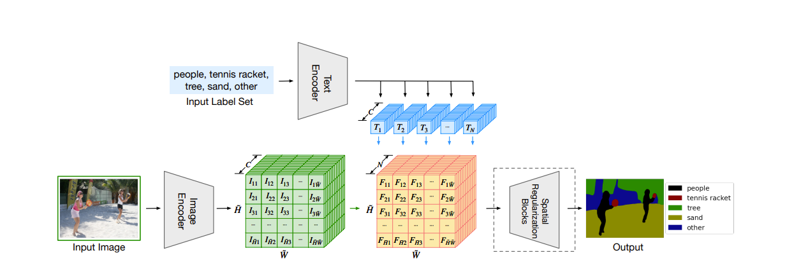
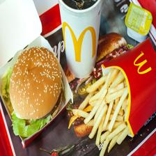
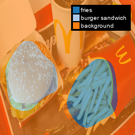
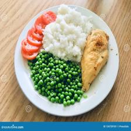
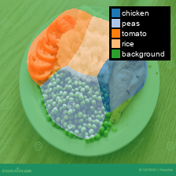

# Language-Driven Semantic Segmentation for Food Images

A re-implementation of **LSeg (Language-Driven Semantic Segmentation, ICLR 2022)** adapted to the food domain using the **FoodSeg103** dataset.

[](https://arxiv.org/abs/2201.03546)
[](https://github.com/LANCETLab/FoodSeg103)

---

## Overview

This project re-implements the LSeg paper with a focus on **food domain adaptation**. Due to GPU constraints, I trained exclusively on **FoodSeg103** (103 food categories, ~7,000 images) instead of large-scale datasets, demonstrating LSeg's effectiveness in specialized domains with limited computational resources.

The model performs **zero-shot semantic segmentation**—segmenting any object you describe in natural language, without being restricted to predefined classes.

---

## What is Zero-Shot Segmentation?

Traditional semantic segmentation models are limited to a fixed set of classes. **Zero-shot segmentation** removes this limitation:

- Segment **any object** you can describe in natural language
- No retraining needed for new categories
- Not restricted to specific classes or numbers
- Simply provide text descriptions (e.g., "pizza", "beverage", "dessert")

**How it works:** LSeg aligns pixel-level visual features with text embeddings in a shared semantic space, allowing the model to understand semantic relationships through language.

<p align="center">
  
</p>

---

## The Original LSeg Paper

**LSeg** by Boyi Li et al. (ICLR 2022) introduced:
- **Text encoder** for computing embeddings of descriptive labels
- **Transformer-based image encoder** for dense per-pixel embeddings
- **Contrastive objective** to align pixel and text embeddings

The key innovation: semantically similar labels map to similar embedding regions (e.g., "cat" and "furry"), enabling generalization to unseen categories without retraining.

---

## Zero-Shot Evaluation

To validate language-driven generalization, I tested with **synonym labels** unseen during training:

| Training Label | Test Synonym |
|----------------|--------------|
| candy | sweets |
| egg tart | custard tart |
| french fries | chips |
| chocolate | cocoa |
| biscuit | cookie |
| popcorn | popped corn |
| pudding | custard |

**Goal:** Verify the model segments food using semantically related vocabulary it has never seen.

---

## Model Architecture

- **Vision Backbone:** DPT (Dense Prediction Transformer) with CLIP-pretrained weights
- **Text Encoder:** Frozen CLIP ViT-B/32
- **Training:** Contrastive pixel-text alignment (temperature: 0.07)
- **Dataset:** FoodSeg103 (5,000 train / 2,000 test images)

---

## Results

### Quantitative Performance

| Metric | Training Set | Test Set (Synonyms) |
|--------|-------------|---------------------|
| **mIoU** | 0.27 | 0.18 |
| **Average Loss** | 1.22 | — |

The 9-point mIoU drop on unseen synonyms aligns with original LSeg findings, showing reasonable zero-shot generalization.

### Qualitative Examples

**Format:** Input Image | Predicted Mask | Overlay

<p align="center">
  
  
  
</p>

<p align="center">
  
  
  
</p>


---

## Installation & Usage

### Setup
```bash
pip install -r requirements.txt
```

### Download Model Weights

1. Download weights from: **[Google Drive Link]** *(link will be added)*
2. Create a `checkpoint` folder in project root
3. Place the weights file inside `checkpoint/`

### Run Demo

```bash
python -m app
```

The Gradio interface allows you to:
- Upload food images
- **Write any text description** (not limited to 103 training classes)
- Get pixel-level segmentation masks
- Test with completely custom labels

---

## Key Contributions

1. **Paper Re-implementation:** Successfully reproduced LSeg architecture and training
2. **Food Domain Adaptation:** Specialized LSeg for fine-grained food categories
3. **Resource-Efficient Training:** Achieved competitive results on 7K images vs. large-scale datasets
4. **Zero-Shot Validation:** Demonstrated language generalization through synonym testing
5. **Interactive Demo:** Built Gradio interface for practical experimentation

---

## Technical Stack

**Framework:** PyTorch | **Pretrained Models:** CLIP (OpenAI) | **Architecture:** DPT + Language Alignment | **Dataset:** FoodSeg103 | **Interface:** Gradio

---

## References

**Original Paper:**
```bibtex
@inproceedings{li2022lseg,
  title={Language-driven Semantic Segmentation},
  author={Li, Boyi and Weinzaepfel, Philippe and Revaud, Jerome and Arnab, Anurag and Schmid, Cordelia},
  booktitle={International Conference on Learning Representations (ICLR)},
  year={2022}
}
```

**FoodSeg103 Dataset:**
```bibtex
@inproceedings{wu2021foodseg103,
  title={A Large-Scale Benchmark for Food Image Segmentation},
  author={Wu, Xiongwei and Fu, Xin and Liu, Ying and Lim, Ee-Peng and Hoi, Steven CH and Sun, Qianru},
  booktitle={ACM International Conference on Multimedia},
  year={2021}
}
```

---

**⭐ If this project is useful, please consider starring the repository!**
